# Billflow – Funkció Napló (Feature Log)

Ez a napló rögzíti a funkciók státuszváltozásait és mérföldköveit.

## Mérföldkövek és Események

```mermaid
timeline
    title Billflow Rendszer Mérföldkövek
    section Specifikáció
        2026-09-18 : UI/UX specifikáció véglegesítése (DESIGN.md)
                   : Backend rendszerterv elkészítése (backend.md)
    section Tervezés & Jóváhagyás
        2026-09-19 : Backend architektúra & fázisterv jóváhagyva
                   : FEAT-001 - FEAT-007 jóváhagyva (Approved)
                   : FEAT-008 & FEAT-009 elutasítva (Sallangmentesítés)
    section Phase 1 (Befejezve)
        2026-09-19 : MySQL adatbázisséma és Sequelize modellek kialakítása
                   : Express alapok és Docker infrastruktúra konfigurálása
    section Phase 2 (Befejezve)
        2026-09-19 : JWT és HttpOnly cookie hitelesítési rendszer
                   : Háztartáskezelés és meghívókódos csatlakozás (/api/auth)
    section Phase 3 (Befejezve)
        2026-09-19 : Bankszámlák CRUD és soft delete (/api/accounts)
                   : Fix költség sablonok CRUD (/api/fixed-expenses)
    section Phase 4 (Befejezve)
        2026-09-19 : Havi Műszerfal & fedezetszámítás (/api/dashboard)
                   : Ténybefizetések, felülbírálás, unpay & skip (/api/expenses)
    section Phase 5 (Befejezve)
        2026-09-19 : Web Push VAPID előfizetések (/api/push)
                   : Napi 08:00 cron emlékeztető folyamat (reminderWorker)
    section Frontend F1 (Befejezve)
        2026-09-19 : Vite + React + TS, Design tokenek (világos/sötét)
                   : Reszponzív váz: Mobil alsó sáv FAB-bal, Asztali oldalsáv
    section Frontend F2 (Befejezve)
        2026-09-19 : Áttekintés Képernyő (HeroCard, Lejárt sáv, Napi lista)
                   : Egykattintásos fizetés, Undo toast, Asztali 12 oszlopos rács
    section Frontend F3 (Befejezve)
        2026-09-19 : Tételek Képernyő (ItemsSummaryCard, FilterBar, UrgentActionCard)
                   : Részletes szerkesztő és új tétel modal sheet (Mockup 2 & 3)
    section Frontend F4 (Befejezve)
        2026-09-19 : Naptár nézet (CalendarPage) hétfői kezdettel és napi listával
                   : Számlák kezelése (AccountsPage & Modal) színválasztóval
                   : Beállítások & Háztartáskezelés (SettingsPage) meghívókóddal
    section Frontend F5 (Befejezve)
        2026-09-19 : PWA Manifest, Ikonok, Standalone mód és Telepíthetőség
                   : Service Worker offline gyorsítótár (Stale-While-Revalidate)
                   : Web Push kliens feliratkozás és háttér-értesítések kezelése
    section Tétel Részletek & Előzmények (Befejezve)
        2026-09-20 : Teljes képernyős tétel részletező modal
                   : Havi fizetési előzmények trend-jelöléssel (drágulás/csökkenés)
                   : Külön Fizetési Előzmények modal statisztikákkal (átlag, min, max)
    section Modal & UX Rendszerarchitektúra (Befejezve)
        2026-09-20 : 100% full-screen modalok body scroll lock-kal (zéró háttérgörgetés)
                   : Hivatalos stílusú vektoros SVG bank logók (OTP, Revolut, Erste, UniCredit...)
                   : Tételek és Naptár kártya letisztítás (bank emblémák levétele, tiszta dátum)
                   : Kétirányú dinamikus hónap- és évváltás naptárban és tételeknél
                   : Korábban inaktivált előfizetések folytatása előzmények megőrzésével
    section Domain & Felület Tisztítás (Befejezve)
        2026-09-20 : 100% full-screen Befizetés modal és alsó Bezárás gomb eltávolítása
                   : Kifizetett tételek szekció áthelyezve az Áttekintés oldalra
                   : Hero kártya interaktív hónapválasztóvá alakítása dinamikus újrakalkulációval
                   : Tételek oldal átalakítása tiszta fix kiadás és előfizetés törzskatalógussá
    section Áttekintés & Kártya Tisztítás (Befejezve)
        2026-09-20 : Hero kártya hónapválasztó legfelülre helyezve, alatta aktuális nap kártya
                   : Felesleges csoportfejlécek ("1 napja lejárt", "minden hó 24-én") eltávolítva
                   : Relatív esedékességi badge ("X nap múlva", "Ma esedékes") a dátum alá helyezve
    section Háztartáskezelés & Meghívások (Befejezve)
        2026-09-20 : HouseholdInvitation modell 7 napos lejárattal és egyedi tokennel
                   : Teljes körű /api/households REST API és szerepkörkezelés (OWNER / MEMBER)
                   : E-mailes és kódos csatlakozás, kilépés és új háztartás allokáció
                   : Beállítások Háztartási Központ full-screen modális felületekkel
    section Teljes Dockerizálás & Élesítés (Befejezve)
        2026-09-20 : Gyökérszintű docker-compose.yml és központi .env
                   : Külső MySQL (192.168.1.115) integráció és auto-sémalétrehozás
                   : Frontend multi-stage Nginx konténer (Port 18520) /api/ reverse proxyval
                   : Backend Express konténer (Port 18521) lejárt szüneteltetések auto-feloldásával
```

## Eseménynapló

| Dátum | Funkció ID | Esemény | Részletek |
| :--- | :--- | :--- | :--- |
| 2026-09-19 | FEAT-001..007 | Approved | A felhasználó jóváhagyta az implementációs tervet az 5 fázisú lebontással. |
| 2026-09-19 | FEAT-008, 009 | Rejected | Elutasítva a specifikációban a mikromenedzsment és gamifikáció megszüntetése miatt. |
| 2026-09-19 | Phase 1 | Completed | Docker Compose, Sequelize adatmodellek, asszociációk és adatbázis szinkronizáló script kész. |
| 2026-09-19 | Phase 2 | Completed | JWT token segédmodul, Zod validáció, authMiddleware, /api/auth regisztráció, login, me és logout kész. |
| 2026-09-19 | Phase 3 | Completed | Bankszámlák és fix költség sablonok CRUD végpontjai, soft delete és Zod validáció elkészült. |
| 2026-09-19 | Phase 4 | Completed | Havi műszerfal virtuális aggregáció, számlánkénti kötelező fedezetszámítás, /pay, /unpay és /skip végpontok kész. |
| 2026-09-19 | Phase 5 | Completed | Web Push VAPID integráció, böngésző feliratkozás, napi 08:00 reminderWorker és automatikus 404/410 token cleanup kész. |
| 2026-09-19 | Phase F1 | Completed | Frontend Vite + React + TS architektúra, tokens.css, ThemeContext, PrivacyContext, AuthContext, BottomNav és Sidebar elkészült. |
| 2026-09-19 | Phase F2 | Completed | Áttekintés képernyő (HeroCard számlacsíkkal, OverdueBanner, DayGroupList, Toast, DesktopStickySummary) elkészült. |
| 2026-09-19 | Phase F3 | Completed | Tételek képernyő (összegző kártya, szűrők, azonnali teendő banner, lenyitható kifizetések) és tétel szerkesztő/létrehozó modal sheet (Mockup 2 & 3) kész. |
| 2026-09-19 | Phase F4 | Completed | Naptár nézet (hétfői kezdés, státuszpöttyök), Számlák kezelése (színpaletta választó, alapértelmezett kapcsoló), Beállítások (meghívókód vágólapra másolással, tagok listája) kész. |
| 2026-09-19 | Phase F5 | Completed | PWA Manifest, Service Worker offline gyorsítótár, OfflineBanner, Web Push kliens feliratkozás és tesztelés kész. A frontend és backend 100%-ban elkészült! |
| 2026-09-20 | FEAT-004 | Enhanced | Teljes képernyős tétel modal, havi költési trendek (+/- Ft növekedés/csökkenés), Fizetési Előzmények modal statisztikákkal és Befizetés Részletei bizonylat modal kész. |
| 2026-09-20 | FEAT-001, 004 | Enhanced | Magyar bank mikro-ikonok (BankBadge), YYYY.MM.DD dátumformátum a név alatt, lejárt tételeknél piros háromszög popover, széles Befizetés gomb és csökkentett tartalmú teljes képernyős rezsiadminisztrációs modal kész. |
| 2026-09-20 | Plan B (UX/Modal) | Completed | Rendszerszintű Modal & UX Architektúra: 100% full-screen ablakok zéró háttérgörgetéssel (useBodyScrollLock), autentikus vektoros bank emblémák, letisztult kártyák dátummal, 2-oszlopos naptár összegző évválasztóval, görgetésre csukódó kereső és inaktivált előfizetés folytatási lehetőség. |
| 2026-09-20 | UX Refinements | Completed | Tételek kártya: "esedékes" szöveg törlése, összeg a Befizetés gomb felett, felső Új tétel gomb törölve, teljes szélességű Hónapválasztó, "09.19" mini kártya a fejlécben, "rendezve 09.20" badge és újranyitási megerősítő modal, felső "✕" gombok és megnövelt mobil alsó margók. |
| 2026-09-20 | Visual & Nav Polish | Completed | Kifizetett tételeknél pipa helyett kategória ikon, dátum alatt halvány zöld 'rendezve 09.20' badge; Áttekintésen kifizetett tételek elrejtve; Naptár fejlécben felül teljes szélességű Évválasztó (< 2026 >), duplikáció mentesség, hónapszalag alatt esztétikus Aktuális dátum kártya. |
| 2026-09-20 | Domain & UI Cleanup | Completed | 100% full-screen Befizetés modal és alsó Bezárás gomb eltávolítása; Kifizetett szekció áthelyezve az Áttekintésre; Hero kártya interaktív hónapválasztóvá alakítása; Tételek oldal átalakítása tiszta fix kiadás és előfizetés törzskatalógussá (sablonok kezelése, szüneteltetés/folytatás kapcsoló, előzmények és statisztikák, havi fizetés gombok nélkül). |
| 2026-09-20 | Overview Layout & Badges | Completed | Hónapválasztó a HeroCard tetejére áthelyezve, alatta aktuális nap kártya; redundáns csoportfejlécek törölve a DayGroupList-ből; relatív esedékesség badge (X nap múlva, Ma esedékes, X napja lejárt) a dátum alá helyezve a kártyákon, jobb oldali 28.nap badge eltávolítva. |
| 2026-09-20 | Modal & Template Polish | Completed | Hero kártyán "Hátralévő befizetés" felirat; Tételek sablon kártyákból a bank ikon eltávolítva; FixedExpenseModal 100%-os full-screen javítása (createPortal a document.body-ba, min-h-0 belső görgetés, fix fejléc és lábléc). |
| 2026-09-20 | FEAT-006 | Completed | Háztartáskezelés, tagok és meghívási rendszer teljes körű megvalósítása (HouseholdInvitation modell, e-mailes meghívó 7 napos tokennel, szerepkörök kezelése, csatlakozás kód alapján, kilépés és eltávolítás automatikus új háztartás allokációval, Beállítások felület teljes megújítása). |
| 2026-09-20 | FEAT-002 | Enhanced | Előfizetés szüneteltetési időtartam (hónapok száma vagy konkrét lejárati dátumig), kártya alsó gombok 3 oszlopos mobilbarát elrendezése, valamint különálló esztétikus Gyakoriság és Nap badge-ek a Tételek képernyőn. |
| 2026-09-20 | Docker & Deployment | Completed | Projekt szintű docker-compose.yml, központi .env, külső MySQL (192.168.1.115), multi-stage Nginx frontend (18520), Express backend (18521), automatikus adatbázis-létrehozás, sémaszinkronizáció és szüneteltetés-feloldás elkészült. |

