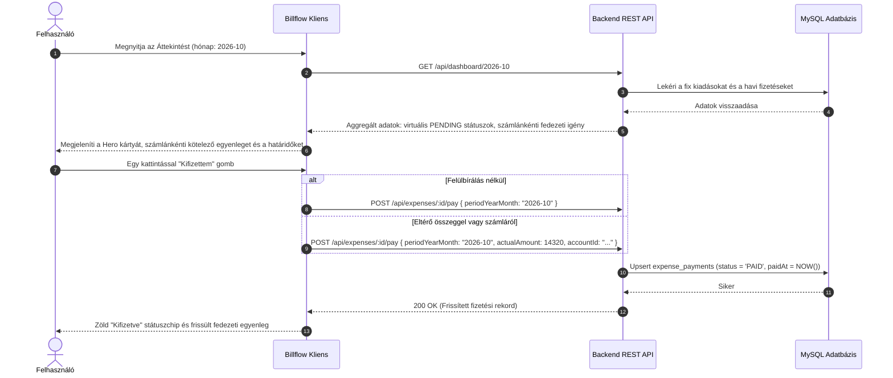
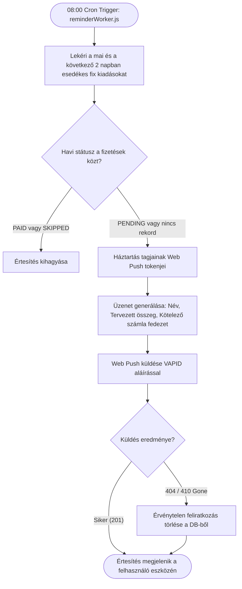

# Billflow – Felhasználói Utak (User Journeys)

A rendszer legfontosabb végfelhasználói folyamatainak ábrázolása.

## 1. Havi Fedezet-ellenőrzés és Tétel Befizetés

## 2. Napi Értesítési és Emlékeztető Folyamat

